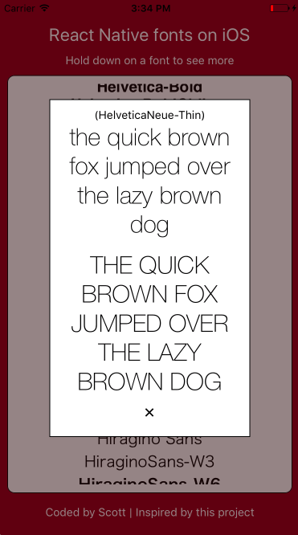

# FontDisplayer
### A React Native app that displays previews of all available fonts on iOS. 

After searching for a resource that displays all available fonts on iOS for React Native, I came across [this repo](https://github.com/dabit3/react-native-fonts) and was inspired to build this app.

Directions: Scroll through the list of available fonts and hold down on the name of a font to see a quick example.

Screenshot:

